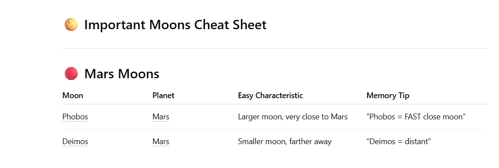

# S3

1. How to create S3 bucket

    

    

    create bucket

2. Upload objects into bucket
3. If newly uploaded object have same name, then old obj will get deleted and replaced with new obj, if you disable versioning
    - if you enable bucket versioning, then do some changes to existing obj and upload same file, then 2 copies will be present with different versions

        


4. Security: 
    - Encryption at rest
    -Encryption at transit
    - acls
    - bucket policies
    - enable logging mechanism like who is accesiong your obj
    - enable notifications

5. Tags= for identifying the resource=like which project does this bucket belong to
    - eg: give list of s3 buckets used by a specific project
6. Server access logging: by default it is disabled, used to remove or restrict actions on  users who is accessing the bucket
7. Event bridge,Event notifications
8. Object lock: will not let any others to update the object similar to not giving edit option on excel to others
9. Static website hosting : allow objects in this bucket to have open access to anyone in the world, it is cheapest as well
10. to restrict access to particular bucket= use bucket policies

Scenario: everyone who have access to S3 bucket can access this obj in my bucket

IAM->users->create user->

1. 

2. custom password

    

3. I am not granting any permissions, next
4. I am creatinga  bucket which is publicaly accessible
5. I have opened incgnito window and logged in with IAM user

    - create I am user and donot attach any policy->next

    

    - create user
    - As you did not attach any policy to user you got this errror

        

    - login as roort user, then add permissions->attach policies directly

        
    
    - search for s3

        
        - next
        -add permisions=amazons3fullaccess not amaxons3filesfullaccess
        - as this user=s3-public-bucket-sneha, have full s3 access is viewing all files int hat bucket
        - but you want to restrict that user from accessing my bucket
        - As devops engineer you  can restrict access to particular bucket, using bucket permissions

        

        - GO to root user->s3->go to bucket to want to restrict->permssions->bucket policy->edit_>define policy

        - I want to block everyone and only give permsision to myself

        

        - sid= simple statment
        - principle= whom do you want to perform this action against?= everyone in aws=*
        - effect=Deny
        - Action=s3
        - Resource= s3 bucket number

        - 
        - 
        -

        - blockeveryone it will block you as well so give cond

 ```
        {
    "Version": "2012-10-17",
    "Statement": [
        {
            "Sid": "blockallpublicaccess",
            "Effect": "Deny",
            "Principal": "*",
            "Action": "s3:*",
            "Resource": "arn:aws:s3:::s3-public-bucket-sneha",
            "Condition": {
                "StringNotEquals": {
                    "aws:PrincipalArn": "arn:aws:iam::606163771299:root"
                }
            }
        }
    ]
}

```
 - the above policy says blocke everyone,except the root user

- 
- when i apply abpove bucket policy the user is not able to access the bucket= insufficient permission to list object


- if we remove teh bucket policy again user can acess the bucket


### Host static website on S3

1. it is very cheap service
2. create a bucket and upload index.html into the bucket
3. bucketname->properties->staticwebsidte hosting->enable

    

    

    

    - once you save changes you get the endpoint

    

    - you get the 403 error

    

    - you have to unblock public access toyour bucket

    

    - you need to add bucket policy, to get permisoon to add all objects access permsion to everyone in internet
    
    - 

    - 

    Note= enable cors if you have javascript in your html where it will download other links

    - how AWS is cost effective even with versioning?
    - you can select storage classes where delete old versions by picking storage as s3 deeparchive storage 