### VPC Creation

```
https://youtu.be/cyy2ok-00qs?si=L_PcL7vuh5Y7sEfg
```

1. **Difference between IPV4 and IPV6**  
    IPv4-private and public ips
    IPv6-only public IPs 

2. Default shared teanancy 
    Dedicated only for you

3. Vpcid- 16digit id new
 Ec2-i-16digit code

 4. DNS-host name disabled
5. VPC is always attached with Main route table ,main nacl = at subnet level

###### point to remember when creating vpc and subnet

1. 2subnets
Subnet1 10.0.0.0/24
Sunet2 10.0.1.0/24-imp
Not 10.0.0.1/24- freshers mistake

2. 1 public
1 private

3. Autoassign public ipv4-do we need to enable
4. Igw-create-detached state
5. Igw-attach
6. 1 vpc- only 1 IGW
7. Public subnets and private subnet have same Route table So I want different route table for each subnet  
8. reate route table= private route table
9. Attach private route table  to private subnet  

**IQ** Default route table routes= will have entire vpc cidr block range 
So subnets inside same vpc can talk each other

10. Private subnets have both public and private subnet associations 
So detach public subnet in association

11. Enable internet to public subnets route table
0.0.0/0 = igw

##### Creation of VPC
1. we are getting 65536 Ips= 2^(32-16) = 2^16=65536
    - /16 = 8 * 2= first 2 blocks are static
    

    

    

#### Creation of Subnets

2. **Note** 
     subnet-1=10.0.0.0/24
     subnet-2=10.0.1.0/24

3. public subnet

    

    

4. ### how to cal 

    - /24= 8*3= means first 3 blocks are static
    - 10.0.0.0/24= 1st subnet have range from 10.0.0.(0-255) Ips are given to subnet 1
    - 10.0.1.0/24= 2nd subnet have range from 10.0.1.(0-255) Ips are given to subnet 2
5. Each subnet is attached with a route table, autoassign of puclic IPV4 adress=No

    

6. After some time you see the subnets will be having NACLs, route tables attached by default

    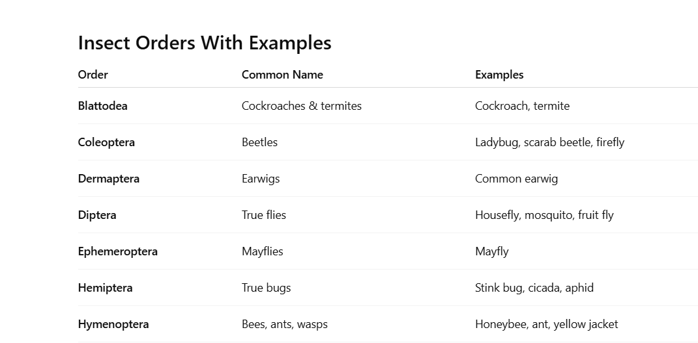


7. Create IGW

    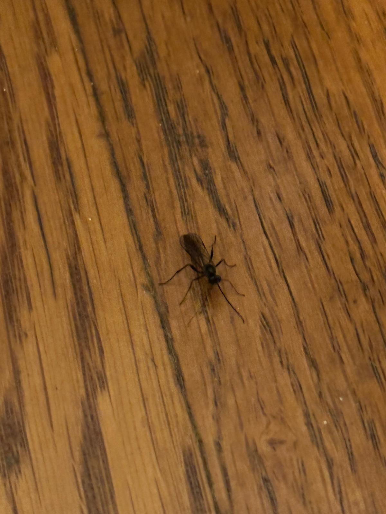

    - It will be in  dettached state, need to attach it to VPC
    - attach to vpc

    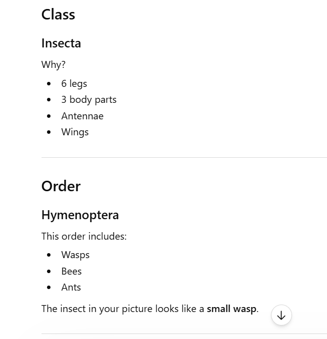

8. The default routetable that has been attached to the private and public subnets are same route table
    - So when I change rules to one route table the rule to other table will gets changed too,so I will create individual rout tables

9. #### create route table

    - I am creating a routetable that I want to attach ot a public subnet

        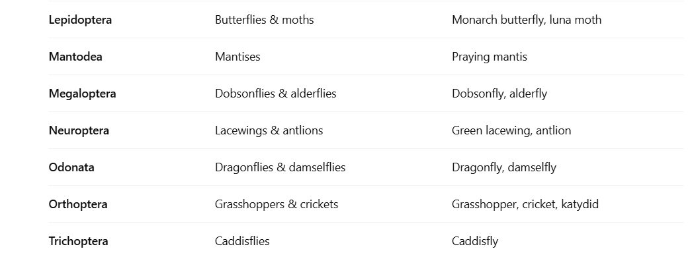
    - renaming the default routetable -private-route-table

        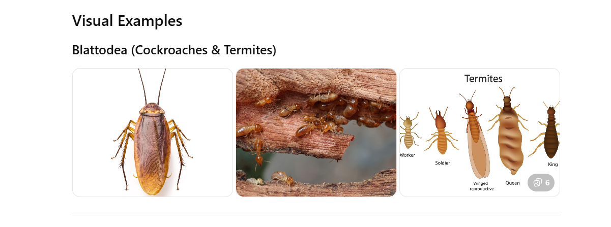

    - Lets check the path wehre these route tables are attached to?
    - we see the default route table that is created while creating subnet(later we renamed as private-route-table) is having routes= 10.0.0.0/16= it is mapped to entire VPC cidr range
    - so for every ruoute table will have this default rule which cannot be deleted
    - that is the reason the subnets inside same VPC can communicate each other

        

    - we cannot remove the default route for ever

    - **Note-IQ**- what is the default route for routetable=entire vpc cidr block

10. ### Subnet associations

    - the default rout table(private-route)= is associated with both the subnets, so lets dettach public subnet from here

        

      attached only private subnet

      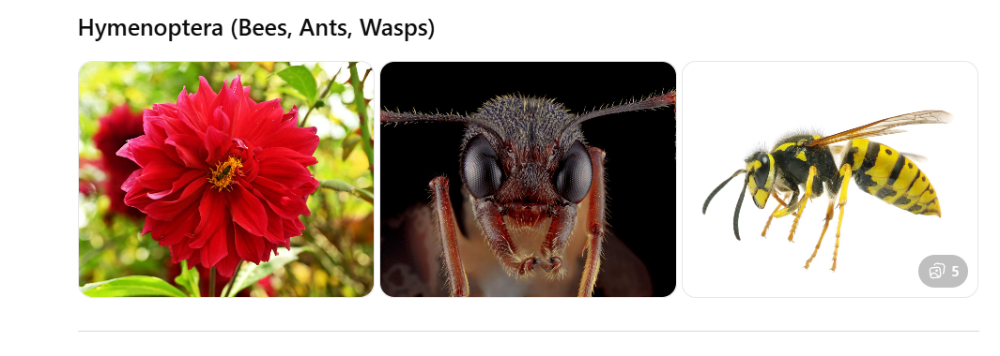

    - attach public subnet with public route table

        

11. ### enabling internet 
    - If we want Internet, then need to add route 0.0.0/0 to routes inside routtable=public route table
    

12. ### creation of LInux instances
    - What is AMI = OS + software snapshot used to launch it
        - OS types: Linux(Amazon linux,ubutu,etc.,), windows 
        - software= webservers(apache,Nginx), docker,java,etc

    - AMI=linux, t2.micro,keyvalue pair

        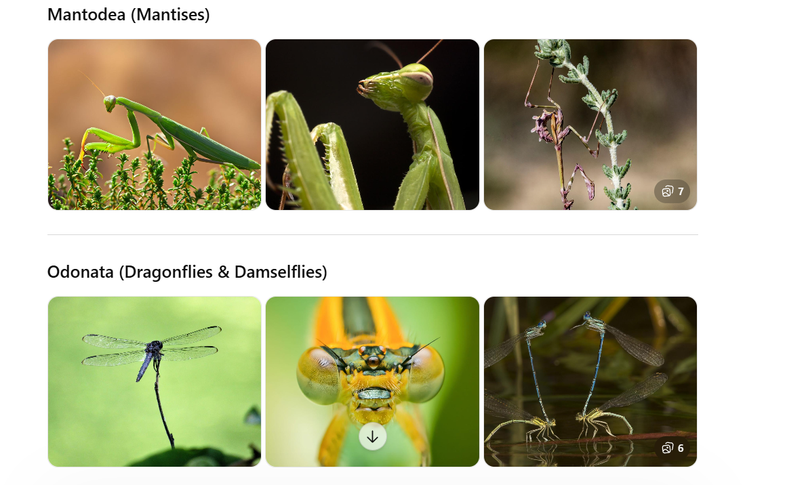

    - Network settings-> edit->demo-vpc->public subnet
        - Autoassign public Ip=enable

            

    - SG= source=0.0.0.0/0(anywhere)= give access to anyone, need ot pick only myIp


        

    - Create privateInstace, private SG
         - to I want to add rule to connect within the vpc through ssh so instead of anywhere, I am giving VPC cidr block

        

13. ### connecting to linux instance
    - using linux

    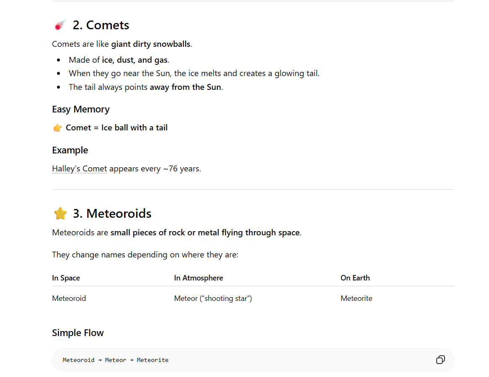)

    - when we connect to public Ec2 we will get connected
    - when we connect to private Ec2 we will get conneciton timed out error, because we did not 

            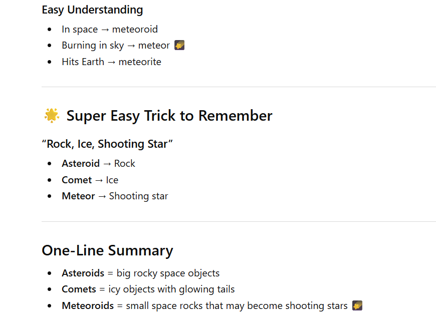
    - Reason: this is private Ec2 isntace, connected to private subnet, private subnet we did not add IGW routes in the private subnet

        

        the below private subnet donot have IGW routes

        

        The below publicsubnet have igw routes. So we are able to connect to internet through public subnet

        
14. Now we can connect ot private ec2 instance internally using public subnet by uploading pem file into public instance using mobaxterm

    

    - open private ec2 instance->connect-> get command

        
    - when I try to login uisng command it screenshot it did not work, so connect using private ec2 ins private ip it worked

    - this is the sg of private ec2 instace

        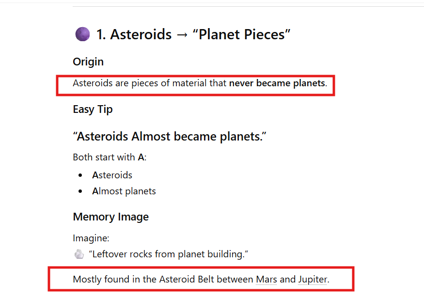

    

15. Test: 
    case-1: removing SG in the private Ec2 isntance

        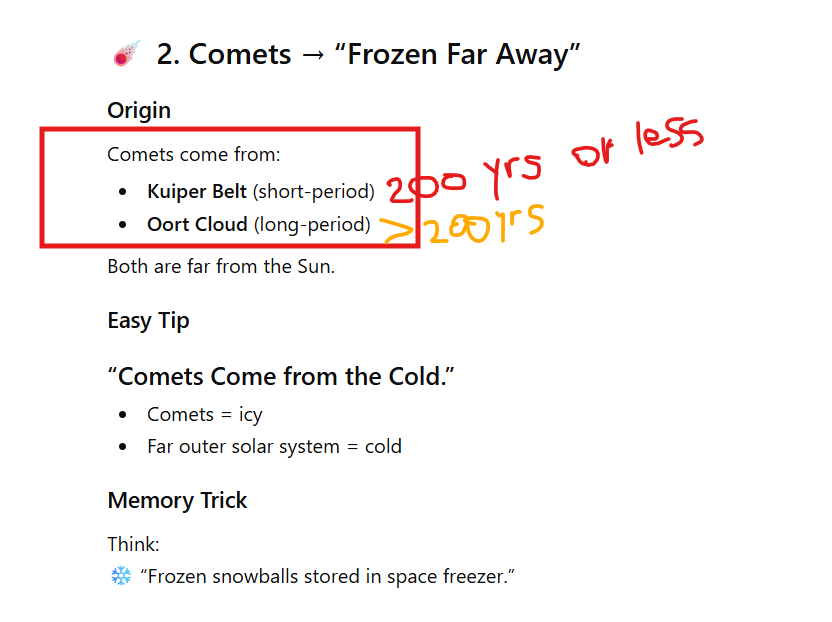

    - when I try to do ssh into private ec2 isntance I am not able to connect as I removed ssh connection in sg of private Ec2 instacne

        

    - I am enabling sg again by copying publicec2 instance = private ip adress. Then I will be able to connect
    - NOte previously we have given entire vpc cidr range, now I am giving only my public ec2 intances private Ip

        

    - I was not able to connect still. Reason: I did not give port 22 

        

    - Now when I give port 22, and public ec2 instances private Ip then I was able to connect

        

        

14. I justw ant to install webserver in public subnet

     - sudo yum install httpd -y
     - sudo service httpd start

        

        

    - command to create index.html = sudo vim /var/www/html/index.html
    - command to insert =i
    - command to save and exit=esc+:wq!
    - take public ipadress 

    -Note you need to create html in correct path other wise it wont work

15. test-2
    - I am removing the SG port 80 inside the publicEc2 instance then you cannot tsee the above output

16. Did a ping test to check if internet is avaialble in privateec2 by logging into it from public Ec2

    

    

 ### Creating NAT Gateway in public subnet 

 17. Create Nat Gateway=Demo vpc
    - NAT getway does network adress translation= which mens it will convert the private ipadress of Ec2 instance to i , so it will provide security
    - helps private instance to connect to internet
    ec2 private ip->natgateway->Natgatewaystaticip->internet

    publicIp= temporary ip, ip changes when we restart teh server
    staticIp/Elastic Ip= it will be permament, even if instance restarts it iwll be same, when we buy a domain name, this static ip will be attached to it

    

    - as  i have picked ellastic Ip to be allocated manually I got allocated to 2 elastic Ips , 1 per Az so make sure to delete both elastic ips other wise it will get charged 

18. Now need to attach rule in private routetable, add routes=0.0.0.0/0--->NAT Gateway

    

    - save the rules and now private instance have internet access
    - we can test it by ping command. previously we were not able to connect, but now we will be able to connect to internet

    

    NOte: we cannot connect from outside world to privateec2, we can connect only from private ec2 to outside world

    - Test it by taking the publicIp or privateIp of private ec1inst, connect directly from mobaexterm
    - it wont connect
    - Test2 take natgateway Ip address
    - we get error in both 2 testes

19. Deelte all 
    - delete Nat gateway
    - delete ellastic ips(automatically got deleted once I delete nat gateway)
    - dettach igw
    -  delete 2 Ec2 instances
    - delete VPC
20. go to vpc dashboards and check what all are in use

    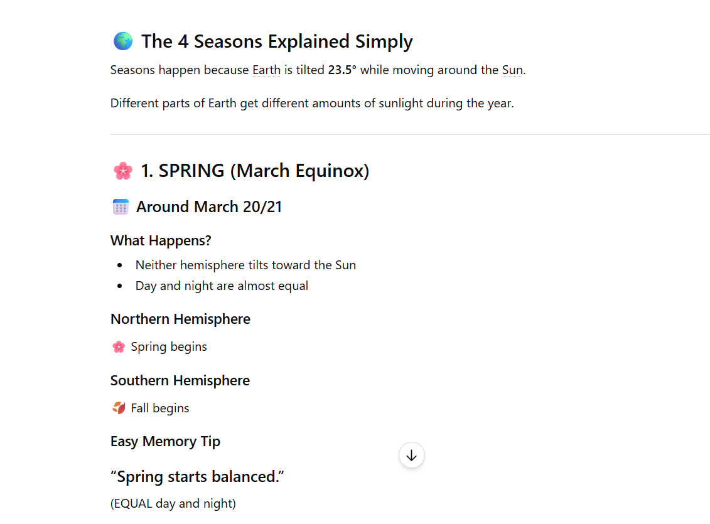

